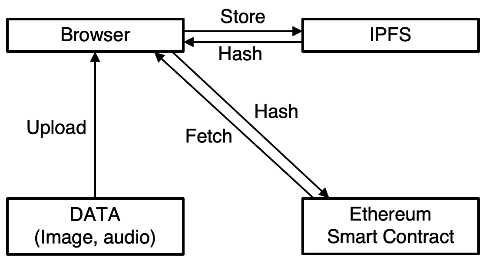

# Build Ethereum Dapp with IPFS - blockchain programming tutorial
190905 기준 튜토리얼이라 web3.js의 최신버전 혹은 다른 구현 방식 web3.storage (high-level implementation) 등은 따로 더 리서치 필요!
## Overview


```

```

## Reference
#### [Youtube link](https://www.youtube.com/watch?v=pTZVoqBUjvI&t=1113s)
#### [Github](https://github.com/dappuniversity/starter_kit)